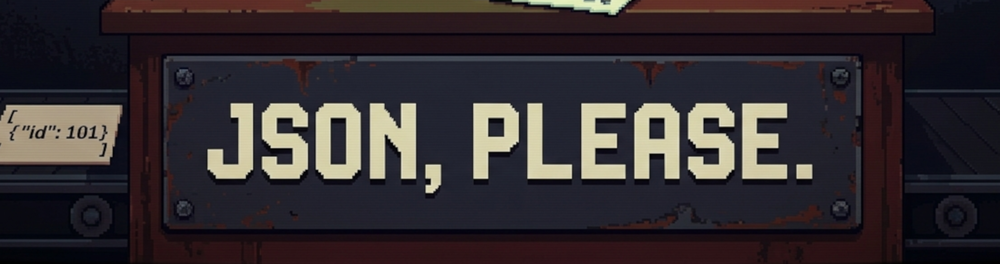

Simple and fast json serializer-deserializer in C++.

- Author:  Giovanni Santini
- Mail:    giovanni.santini@proton.me
- License: MIT

## Example

Serialization:

```cpp
auto json = Json({{"name",   this->name},
                  {"age",    this->age},
                  {"height", this->height}});
std::string json.serialize();
```

Deserialization:

```cpp
auto json = Json::parse("{\"age\": 69, \"height\": 1.95, \"name\": \"Foo\"}");
auto person = Person(json.value());

ASSERT(person.name == "Foo");
ASSERT(person.age  == 69);
ASSERT(std::abs(person.height - 1.95) < 0.0001);
```

This is how you can use the library to serialize a class:

```cpp
class Person
{
public:
  std::string name;
  int         age;
  float       height;

  Person(const std::string& name, int age, float height)
    : name(name), age(age), height(height) {}
  Person(jp::Json& json)
  {
    this->from_json(json);
  }
    
  jp::Json to_json()
  {
    return jp::Json({{"name",   this->name},
                     {"age",    this->age},
                     {"height", this->height}});
  }
  void from_json(jp::Json& json)
  {
    this->name   = std::get<std::string>(json["name"]);
    this->age    = std::get<int>(json["age"]);
    this->height = std::get<float>(json["height"]);
  }
};
```

## Usage

The library is just composed of one header and one `cpp` file so you
could copy-paste them in your project. Or you can add the library
to your build system in many ways, via a git submodule or CPM for
example.

To build the library:

```
cmake -Bbuild && cmake --build build
```

Build and run tests using the amazing [valFuzz](https://github.com/San7o/valFuzz):

```
cmake -Bbuild -DCMAKE_BUILD_TYPE=Debug -DJP_BUILD_TESTS=on
cmake --build build
./build/json-please_tests --verbose
```
